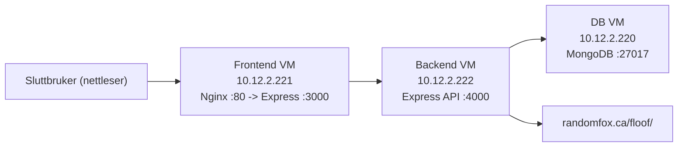

# Prosjektskisse: arkitektur, IP-plan og database

## Arkitektur

## IP-plan

| Rolle | VM | IP | Eksponerte porter | Tilgang |
|---|---|---|---|---|
| Frontend | `foxvote-frontend` | `10.12.2.221` | `80/443` | Offentlig |
| Backend | `foxvote-backend` | `10.12.2.222` | `4000` | Kun fra frontend-VM |
| Database | `foxvote-db` | `10.12.2.220` | `27017` | Kun fra backend-VM |

## Databaseoversikt

MongoDB database: `foxvote`

Kolleksjon: `fox_votes`

| Felt | Type | Beskrivelse |
|---|---|---|
| `foxId` | Number (unik) | Rev-ID utledet fra bilde-url |
| `imageUrl` | String | URL til bilde hos randomfox |
| `votes` | Number | Antall stemmer |
| `createdAt` | Date | Opprettet tidspunkt |
| `updatedAt` | Date | Sist oppdatert |

Indekser:
- Unik indeks på `foxId`
- Sorteringsindeks på `{ votes: -1, foxId: 1 }`
